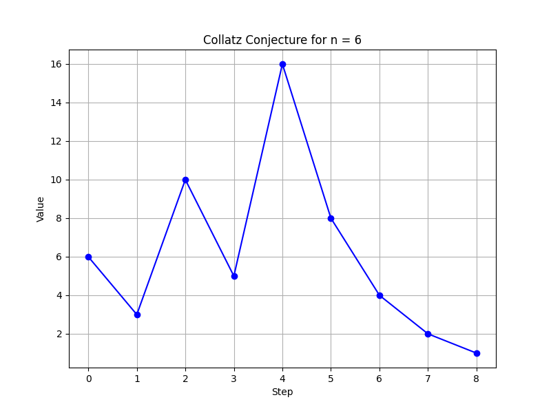

# Repository Contents

This repository contains various Python scripts and associated image files related to mathematical concepts and algorithms. Below is a brief description of each file:

### Python Scripts

1. `collatz.py`: This script implements the Collatz conjecture algorithm. It takes an integer as input and applies the Collatz sequence until it reaches 1.
2. 

3. `eAix.py`: This script performs some calculations related to the mathematical constant "e" raised to the power of "i * x," where "i" is the imaginary unit and "x" is a real number.
4. 

5. `eigen.py`: This script deals with eigenvalues and eigenvectors of matrices. It computes the eigenvalues and eigenvectors of a given matrix.

6. `euler.py`: This script contains implementations of various algorithms related to Euler's number and Euler's formula.

7. `fermattheorem.py`: The script explores Fermat's Last Theorem, which states that no three positive integers a, b, and c can satisfy the equation a^n + b^n = c^n for any integer value of n greater than 2.

8. `gcd.py`: This script calculates the Greatest Common Divisor (GCD) of two integers using the Euclidean algorithm.

9. `maxi.py`: This script provides functions to find the maximum element in a list of numbers.

10. `prime.py`: The script includes functions to check whether a given number is prime or not.

11. `primefacto.py`: This script finds the prime factors of a given number.

12. `pytha.py`: The script deals with the Pythagorean theorem and contains functions to calculate the length of the hypotenuse or one of the other two sides of a right-angled triangle.

13. `riemann.py`: This script relates to the Riemann hypothesis, one of the most famous unsolved problems in mathematics, and contains functions to explore aspects of the hypothesis.

### Images

The repository also includes several PNG images, each associated with a specific concept or algorithm:

1. `collatz.png`: An image representing the Collatz conjecture or its visualization.

2. `eAix.gif`: A GIF image related to the mathematical constant "e" raised to the power of "i * x."

3. `eigen.png`: An image depicting the concept of eigenvalues and eigenvectors.

4. `euler.png`: An image related to Euler's number and Euler's formula.

5. `fermattheorem.png`: An image representing Fermat's Last Theorem.

6. `gcd.png`: An image relevant to the Greatest Common Divisor (GCD) and its computations.

7. `maxwell_gauss.png`: An image associated with Maxwell's Gauss theorem.

8. `prime.png`: An image related to prime numbers and their properties.

9. `primefacto.png`: An image depicting prime factorization.

10. `pythagoras.png`: An image representing the Pythagorean theorem.

11. `riemann.png`: An image associated with the Riemann hypothesis.

Overall, I coded these graphs to show my interst for mathematics. I really loved that I was able to reminsce my high school mathematics lecture and some olympiad level lectures. Anyways, feel free to explore and utilize these scripts and images for educational or personal purposes. If you have any questions or suggestions, please don't hesitate to reach out to me via `contact@adit.com.np`. Namaste!🙏
